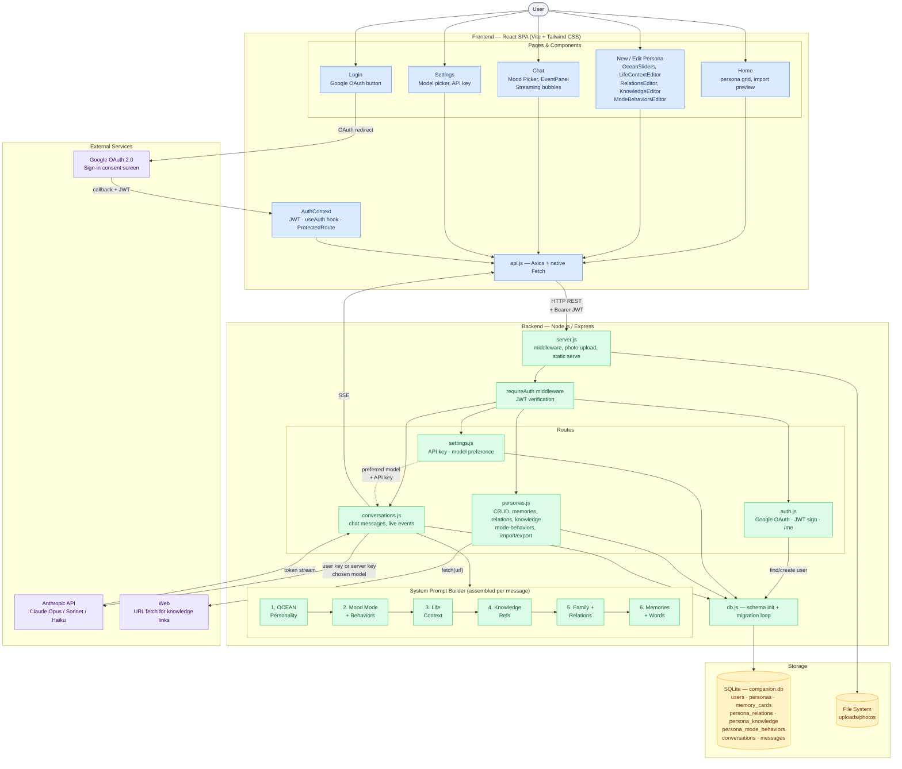

# My Companion

A warm, AI-powered companion app for people who are living alone, elderly citizens, and those who want to keep the memory of a loved one alive — whether they are far away or no longer with us.

Users create rich profiles of their loved ones — calibrating personality scientifically, recording their world in detail, pasting their actual words, and attaching real reference material. The AI speaks in that person's voice, grounded entirely in what is known, never inventing.

---

## Features

- **Loved-one personas** — Create a profile for anyone: a parent, grandparent, old friend, or partner. Add a photo, relationship label, personal notes, and sample words.
- **Big Five (OCEAN) personality system** — Calibrate personality scientifically with five sliders (0–100). Each slider shows a live plain-language description as you adjust it. The scores become a detailed psychological brief inside the AI's system prompt.
- **Life & world context** — Record where they live, their regularly visited places (each with a category: park, supermarket, café, restaurant, church, library, hospital, and more), interests and hobbies (toggle-pill selector), likes, dislikes, daily routine, and other factual details. The AI uses only what is recorded — it never invents details about their life.
- **Family & connections** — Add the people both of you know (family, friends, colleagues), with dual relationship labels — how the persona knew them and how you know them. The AI references these names naturally in conversation.
- **Memory cards** — Attach specific stories and moments so the AI can bring them up naturally, the way a real person would.
- **Knowledge & references** — Upload `.md` or `.txt` files (Wikipedia exports, interview transcripts, blog posts) or paste web links. The server fetches and stores the page text. The AI draws on these facts in conversation without inventing beyond them.
- **Mood mode selector** — Set the persona's current emotional state mid-conversation: Normal, Happy, Nostalgic, Tired, Sad, Worried, Excited, Unwell, or Busy. The AI immediately adjusts its tone, energy, and behaviour to match. The mode persists across page reloads and is stored per conversation.
- **Mood behaviours** — Define exactly how *this specific person* expresses each mood. Goes beyond the generic mood description — e.g. *"when tired, she still asks about the kids but keeps sentences short and mentions her back is hurting"*. Layered on top of the OCEAN personality for uniquely personal responses.
- **Live events** — Inject real-world context mid-conversation with a single tap: time of day, weather, how you're feeling, occasions, life moments, or a custom event. The persona reacts in character immediately.
- **Streaming AI conversations** — Responses stream token by token via Server-Sent Events, just like a real conversation.
- **Conversation history** — All chats are saved and can be resumed. Start a fresh conversation any time.
- **Import & export personas** — Export any persona as a fully self-contained `.json` file — photo, OCEAN scores, life context (including categorised places), likes, dislikes, relations, memories, knowledge sources, mood behaviours, and sample words all included. Import on any instance with a full preview (shows places, interests, memory count, connection count, and knowledge source count) before confirming.
- **Google OAuth login** — Sign in with your Google account. Every user has a private, isolated set of companions — no one else can see your conversations or profiles.
- **Per-user Anthropic API key** — Optionally supply your own `sk-ant-…` key via the Settings page. The app uses your personal Anthropic quota for every conversation. Falls back to the server's shared key if none is set.
- **Model selector** — Choose which Claude model powers your conversations: Opus (most expressive), Sonnet (balanced), or Haiku (fastest). Set per user in Settings; takes effect on the next message.
- **Warm, accessible UI** — Designed for elderly and non-technical users. Soft warm palette, serif typography, clear layout.

---

## Architecture



### File tree

```
myCompanion/
├── nixpacks.toml             Railway build configuration
├── backend/                  Node.js + Express API server
│   ├── server.js             Entry point — middleware, photo upload, serves built frontend
│   ├── database/
│   │   └── db.js             SQLite schema + automatic migration loop for all new tables/columns
│   ├── middleware/
│   │   └── auth.js           JWT verification middleware (requireAuth)
│   ├── routes/
│   │   ├── auth.js           Google OAuth strategy, JWT signing, /me endpoint
│   │   ├── settings.js       API key (save/remove) + model preference endpoints
│   │   ├── personas.js       Full CRUD, memory/relation/knowledge/mode-behavior/import/export endpoints
│   │   └── conversations.js  Streaming chat + live events + system prompt builder (all layers)
│   └── uploads/photos/       Uploaded persona photos (git-ignored)
│
└── frontend/                 React SPA (Vite)
    └── src/
        ├── App.jsx            Router (react-router-dom v6) + ProtectedRoute
        ├── api.js             Axios client + all API helpers
        ├── context/
        │   └── AuthContext.jsx  Google auth state, JWT storage, useAuth hook
        ├── utils/
        │   └── modes.js       Shared mood mode definitions (emoji, label, hint, generic description)
        ├── pages/
        │   ├── Login.jsx      Google sign-in page
        │   ├── AuthCallback.jsx  Handles OAuth redirect, stores JWT, navigates home
        │   ├── Home.jsx       Persona grid, import button, full import preview modal
        │   ├── NewPersona.jsx Create persona — all sections, staged drafts
        │   ├── EditPersona.jsx Edit persona + live memory/relation/knowledge management
        │   ├── Chat.jsx       Full-screen streaming chat, mood picker, live event injection
        │   └── Settings.jsx   Model selector + API key management
        └── components/
            ├── Layout.jsx              Navbar (user menu with Settings link + sign out) + page wrapper
            ├── PersonaCard.jsx         Card with avatar, export/edit/delete actions
            ├── OceanSliders.jsx        Big Five sliders with gradient fill + live descriptions
            ├── LifeContextEditor.jsx   Location, categorised places editor (17 categories), interests, likes, dislikes, routine
            ├── RelationsEditor.jsx     Family & connections editor
            ├── KnowledgeEditor.jsx     Upload .md/.txt files or fetch web links as reference material
            ├── ModeBehaviorsEditor.jsx Per-mood custom behavior definitions (accordion list)
            └── EventPanel.jsx          Live event panel — presets + custom input
```

---

## Technology Stack

| Layer | Technology | Why |
|---|---|---|
| **Frontend framework** | React 18 + Vite | Fast dev experience, component model ideal for chat UI |
| **Routing** | react-router-dom v6 | Simple declarative routing for SPA |
| **Styling** | Tailwind CSS v3 | Utility-first; custom warm colour palette defined in config |
| **Icons** | lucide-react | Lightweight, consistent icon set |
| **HTTP client** | Axios | Clean API with interceptors; streaming via native Fetch API |
| **Backend framework** | Express.js | Minimal, flexible Node.js server |
| **Database** | SQLite (better-sqlite3) | Local, zero-config, synchronous — no database server needed |
| **File uploads** | Multer | Simple multipart form handling for persona photos |
| **Authentication** | Passport.js + Google OAuth 2.0 | Familiar sign-in flow; stateless JWT for long-term sessions |
| **AI model** | Claude Opus / Sonnet / Haiku | User-selectable; defaults to Opus for the richest, most expressive voice |
| **AI streaming** | Anthropic Node.js SDK + SSE | Token-by-token streaming for a natural, real-time feel |
| **Deployment** | Railway + Nixpacks | Single-service deploy; persistent volume for SQLite and uploads |
| **Environment** | dotenv | API key and config management |

---

## How the AI Persona Works

Every message triggers a system prompt assembled from all layers of the persona's profile. Each layer narrows the AI's voice further — from broad personality down to the exact mood of that specific person on that specific day.

### 1. Big Five (OCEAN) personality profile
Five calibrated scores (0–100) are translated into a trait-by-trait narrative that shapes the AI's entire voice:

| Trait | Low end | High end |
|---|---|---|
| **Openness** | Practical, conventional | Imaginative, curious |
| **Conscientiousness** | Spontaneous, flexible | Organised, diligent |
| **Extraversion** | Reserved, introspective | Outgoing, expressive |
| **Agreeableness** | Frank, direct | Warm, compassionate |
| **Emotional Sensitivity** | Calm, steady | Heartfelt, expressive |

A score of 85 on Agreeableness becomes: *"Deeply warm and compassionate — always puts others first; extraordinarily gentle and kind in every word and action."*

### 2. Mood mode
The current emotional state of the persona, selected from the chat header and persisted per conversation. When a mode is active, the system prompt receives a specific directive about energy level, verbosity, and behaviour — e.g. for **Tired**: *"responses are slower, gentler, and shorter than usual — still loving, but quieter."*

Available modes: Normal · Happy 😊 · Nostalgic 💭 · Tired 😴 · Sad 😢 · Worried 😟 · Excited 🎉 · Unwell 🤒 · Busy ⚡

### 3. Mood behaviours (persona-specific)
For each mood, you can describe exactly how *this person* expresses that state. This is layered on top of the generic mood description. For example:

> **Tired** (generic): *low energy, quieter, shorter responses*
> **Tired** (this persona): *"still asks about the kids but keeps sentences short; mentions her back is hurting"*

The result is a response that sounds like a tired version of *them*, not just a generic tired person. Applies to all 9 modes including Normal, where it acts as a general behavioral baseline.

### 4. Life & world context
Known facts assembled into a grounded brief injected into every system prompt:

- **Where they live** — town, city, or neighbourhood
- **Places they regularly visit** — each place is stored with a name and one of 17 categories (🌳 Park/Garden · 🛒 Supermarket/Shop · 🍽️ Restaurant · ☕ Café · 🍺 Pub/Bar · 🎬 Cinema/Theatre · ⛪ Church · 📚 Library · 🏥 Hospital/Clinic · 💊 Pharmacy · 💪 Gym · 🏫 School · 🏦 Bank · 🏨 Hotel · 🏖️ Beach/Outdoors · 🏘️ Community centre · 📍 Other). The AI is instructed to reference these places by name and type naturally — the way someone who actually goes there would mention them in passing, never as an announcement.
- **Interests and hobbies** — from the toggle-pill selector (grouped into 7 categories)
- **Things they like and dislike** — free-text tags
- **Typical daily routine** — a sketch of their day
- **Other known details** — occupation, beliefs, habits, anything else that matters

### 5. Knowledge & references
Uploaded documents and fetched web pages are stored as text and injected into the system prompt as a factual reference section. The AI can draw on biographical details, published writing, interviews, or any structured text — but is still bound by the grounding rule not to invent beyond what is written.

### 6. Family & connections
People both the persona and the user know, with dual relationship labels. The AI references them naturally — "How's your brother John getting on?" — without being told.

### 7. Personal notes & sample words
Free-form notes for quirks and habits, plus pasted letters, texts, or emails. The model mirrors the persona's natural phrasing from these samples.

### 8. Memory cards
Specific stories and shared moments the AI can bring up naturally during conversation.

### 9. Live events
Mid-conversation context injections (e.g. *"It's Christmas morning"*, *"I just got promoted"*) stored as `[Event: ...]` messages. The persona reacts immediately in character.

### Personality-driven voice instructions
The "How to speak" section in every system prompt translates the OCEAN scores into concrete behavioural directives applied throughout the response — not just at the start:

| Trait | Low (≤40) directive | High (≥60) directive |
|---|---|---|
| **Openness** | Grounded, practical, prefers the familiar | Curious, imaginative, connects ideas |
| **Conscientiousness** | Relaxed, spontaneous, goes with the flow | Reliable, structured, mentions plans and follow-through |
| **Extraversion** | Thoughtful, quietly present, measured | Warm, expressive, energised by the exchange |
| **Agreeableness** | Frank, direct, honest even when uncomfortable | Leads with warmth and affirmation |
| **Emotional Sensitivity** | Steady, calm, reassuring presence | Feelings come through openly, responds deeply |

Places are referenced naturally by name — "I was at Tesco earlier" not "I visited my usual supermarket" — and the current mood is required to shape the energy and length of every response, not just the opening.

### Grounding rule
Every system prompt ends with an explicit instruction:
> *Only ever reference places, events, opinions, or experiences explicitly recorded in this profile. Do NOT make up details. If something comes up that you don't know, respond the way a real person would: "I can't quite remember" or "you'd know better than me."*

This prevents hallucinated details and keeps the conversation feeling real rather than fictional.

---

## Import & Export

Personas are fully portable. Every export is a self-contained `.json` file that includes:

| Category | Fields included |
|---|---|
| Core profile | Name, relationship, personal notes, sample words |
| Personality | OCEAN scores (5 values, 0–100 each) |
| Life context | Location, usual places (array of `{name, category}` objects), daily routine, context notes |
| Preferences | Interests (array), likes (array), dislikes (array) |
| Family & connections | All relations with dual relationship labels and notes |
| Memory cards | Title + content for every memory |
| Knowledge sources | Type (file/link), title, URL, and full stored text content |
| Mood behaviours | Custom behavioral description for each of the 9 mood modes |
| Photo | Base64-encoded data URL (fully self-contained, no broken links) |

The import preview shows the personality bar chart, location, places visited, interests, memory count, connection count, and knowledge source count before confirming. Files exported before a new field was added import cleanly — missing values default gracefully.

Export uses an authenticated `fetch()` call with the JWT token so it works correctly behind the auth layer. The download is triggered from a temporary blob URL — no server-side session or cookie required.

---

## Getting Started

### Prerequisites
- Node.js 18+
- An [Anthropic API key](https://console.anthropic.com/settings/api-keys) with credits
- A Google OAuth 2.0 client ID and secret (see below)

### 1 — Create Google OAuth credentials

1. Go to [Google Cloud Console](https://console.cloud.google.com/) → **APIs & Services** → **Credentials**
2. Click **Create Credentials** → **OAuth client ID**
3. Application type: **Web application**
4. Add an **Authorised redirect URI**:
   - Development: `http://localhost:3001/api/auth/google/callback`
   - Production: `https://your-railway-app.railway.app/api/auth/google/callback`
5. Copy the **Client ID** and **Client Secret**

### 2 — Local setup

```bash
# 1. Clone the repo
git clone https://github.com/sachithp/myCompanion.git
cd myCompanion

# 2. Install backend dependencies
cd backend && npm install

# 3. Configure environment variables
cp .env.example .env
```

Edit `backend/.env` and fill in all values:

```
ANTHROPIC_API_KEY=sk-ant-...
PORT=3001
FRONTEND_URL=http://localhost:5173
BACKEND_URL=http://localhost:3001
GOOGLE_CLIENT_ID=your_google_client_id
GOOGLE_CLIENT_SECRET=your_google_client_secret
JWT_SECRET=a_long_random_string        # openssl rand -hex 32
SESSION_SECRET=another_long_random_string
```

```bash
# 4. Install frontend dependencies
cd ../frontend && npm install
```

### 3 — Run

```bash
# Terminal 1 — backend (port 3001)
cd backend && npm run dev

# Terminal 2 — frontend (port 5173)
cd frontend && npm run dev
```

Open **http://localhost:5173** — you will be redirected to the login page. Click **Continue with Google** to sign in and create your account.

---

## Deploying to Railway

The app is configured for a single-service Railway deployment (backend serves the built frontend).

1. Push to GitHub
2. Create a new Railway project → Deploy from GitHub repo
3. Add a **Volume** mounted at `/app/data` (keeps the SQLite database and photos across restarts)
4. In your Google Cloud Console credentials, add the Railway callback URL as an authorised redirect URI: `https://your-app.railway.app/api/auth/google/callback`
5. Set environment variables:

| Variable | Value |
|---|---|
| `ANTHROPIC_API_KEY` | `sk-ant-...` (server fallback key) |
| `DATA_DIR` | `/app/data` |
| `NODE_ENV` | `production` |
| `FRONTEND_URL` | `https://your-app.railway.app` |
| `BACKEND_URL` | `https://your-app.railway.app` |
| `GOOGLE_CLIENT_ID` | From Google Cloud Console |
| `GOOGLE_CLIENT_SECRET` | From Google Cloud Console |
| `JWT_SECRET` | A long random secret string |
| `SESSION_SECRET` | A different long random secret string |

Railway detects `nixpacks.toml` automatically and handles the build and start steps.

---

## Authentication

My Companion uses **Google OAuth 2.0** for sign-in. The flow is:

1. User clicks **Continue with Google** → redirected to Google's consent screen
2. Google redirects back to the backend callback URL
3. Backend finds or creates a user record, signs a **30-day JWT**
4. JWT is passed to the frontend via a redirect to `/auth/callback?token=…`
5. Frontend stores the JWT in `localStorage` and attaches it as `Authorization: Bearer` on every API request
6. All persona and conversation data is **scoped to the authenticated user** — no user can see another user's companions

`express-session` is used only for the brief OAuth state exchange (CSRF protection during the redirect dance). Long-term sessions are stateless JWTs.

---

## Settings

Each signed-in user has a personal settings page (accessible from the avatar dropdown in the navbar) with two options:

### AI Model
Choose which Claude model is used for your conversations:

| Model | Character | Best for |
|---|---|---|
| **Claude Opus** | Most expressive | Emotionally rich, nuanced conversation — the default |
| **Claude Sonnet** | Balanced | Strong quality at lower cost; great everyday choice |
| **Claude Haiku** | Fastest | Quick, frequent short chats; most economical |

The selection is saved immediately and takes effect on the next message sent in any conversation.

### Anthropic API Key
Optionally supply your own `sk-ant-…` key. When set, every conversation in your account uses your personal Anthropic quota. Remove it at any time to fall back to the server's shared key. The full key is never returned to the frontend — only a masked preview (`sk-ant-api0••••••••XXXX`) is shown.

---

## Data & Privacy

All data — personas, memories, conversations, photos, knowledge sources, and mood behaviours — is stored in a SQLite database and a local uploads folder on the server. Each user's data is isolated by their account. Conversation messages are sent to the Anthropic API to generate responses; no other data leaves the server.
